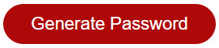
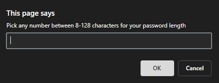
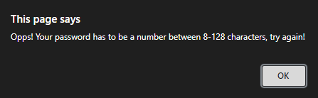
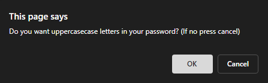
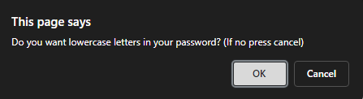
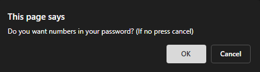
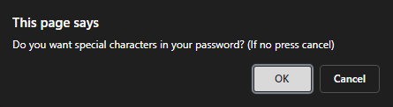
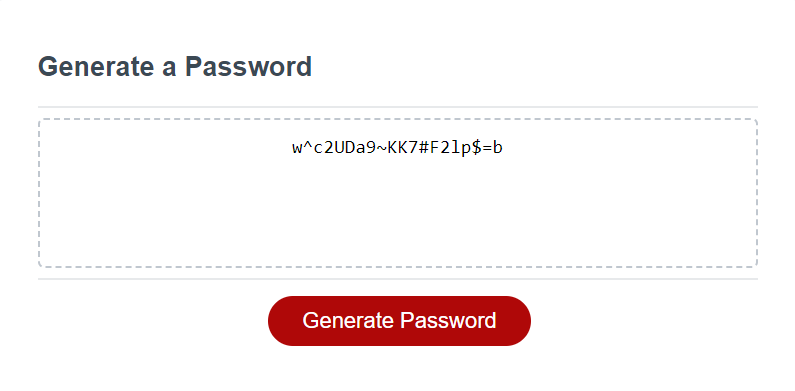

Password Generator!

How to use:
    To generate a password click the red "Generate Password" button

Once Pressed a prompt will appear asking for an input of how long you would like your password to be, your password must be between 8-128 characters long

Your input must be a digit (8) and not spelled out (eight) if an incorrect input is entered you will see this error message and you will be asked to start over

If the correct input was entered you will see a series of new prompts asking you which characters you would or would not like included in your password

Uppercase Prompt:

Lowercase Prompt:

Number Prompt:

Special Characters Prompt:

Depending on the criteria selected your new password will be generated in the text box for you to copy and paste!

